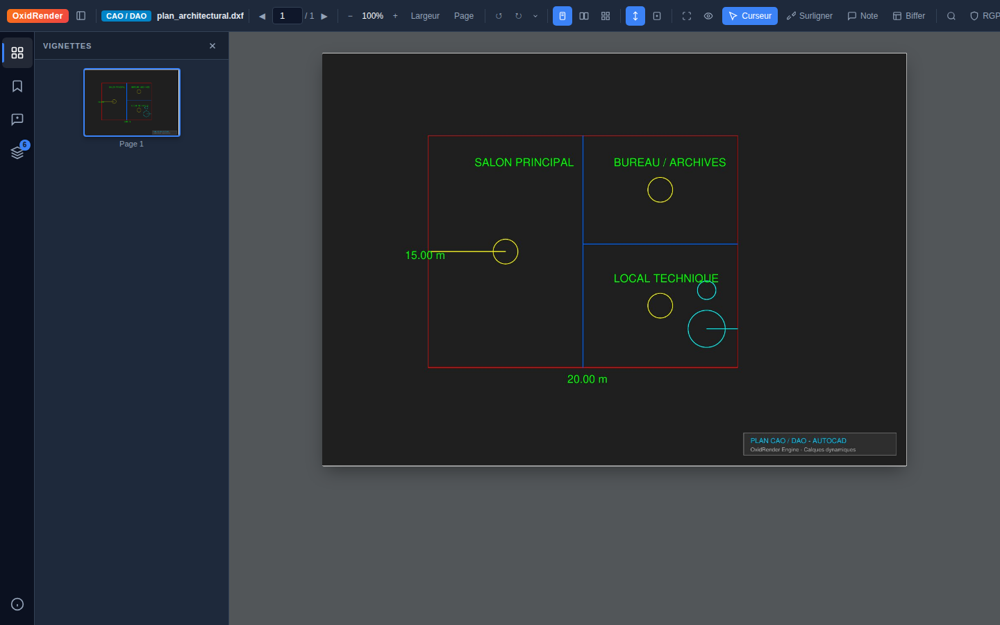
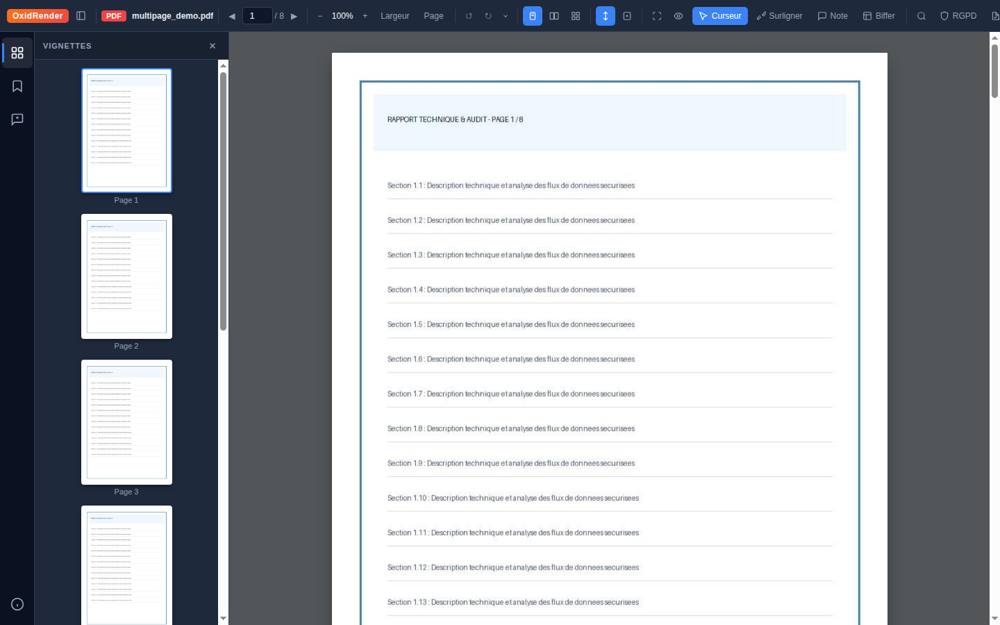
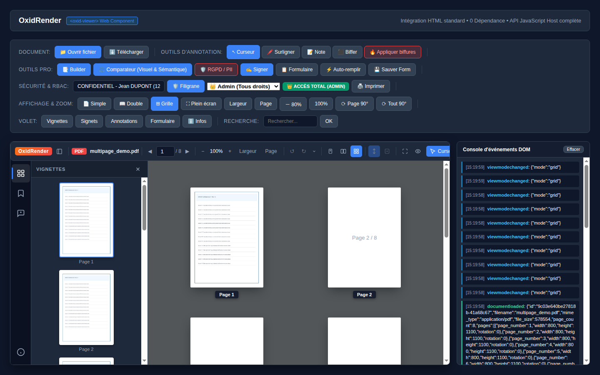
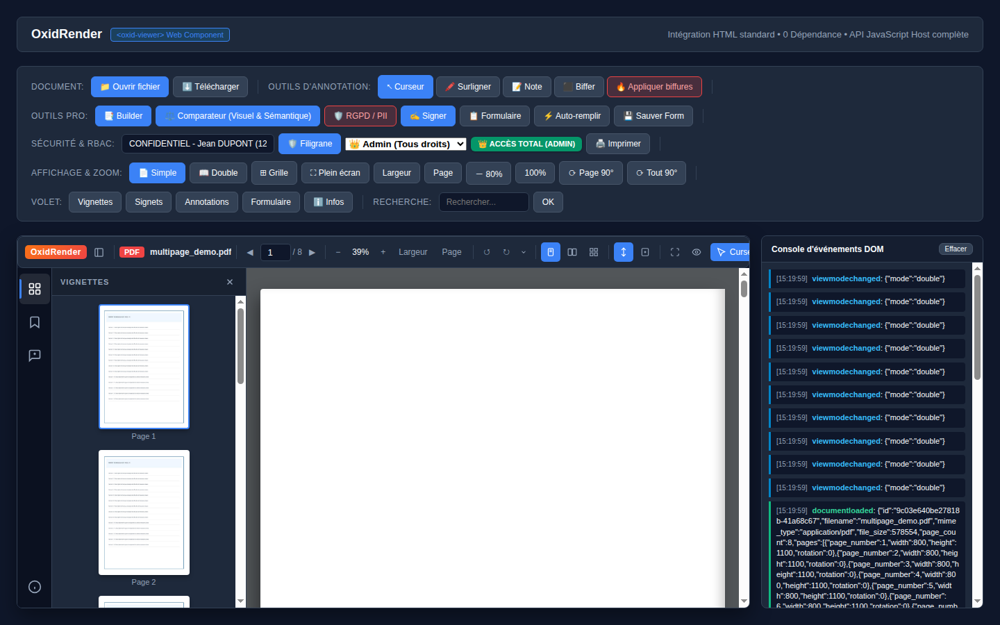
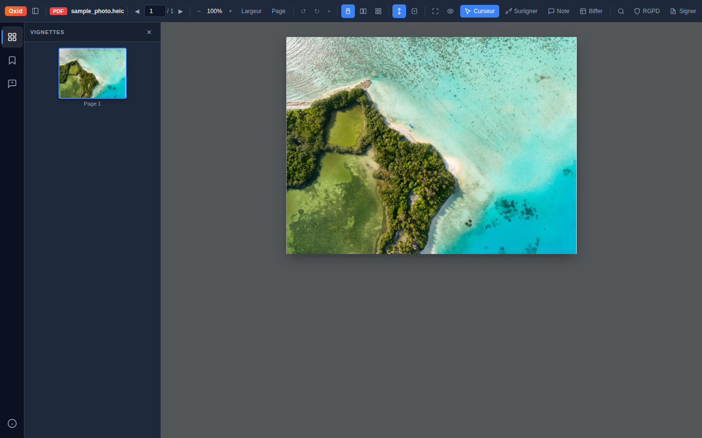
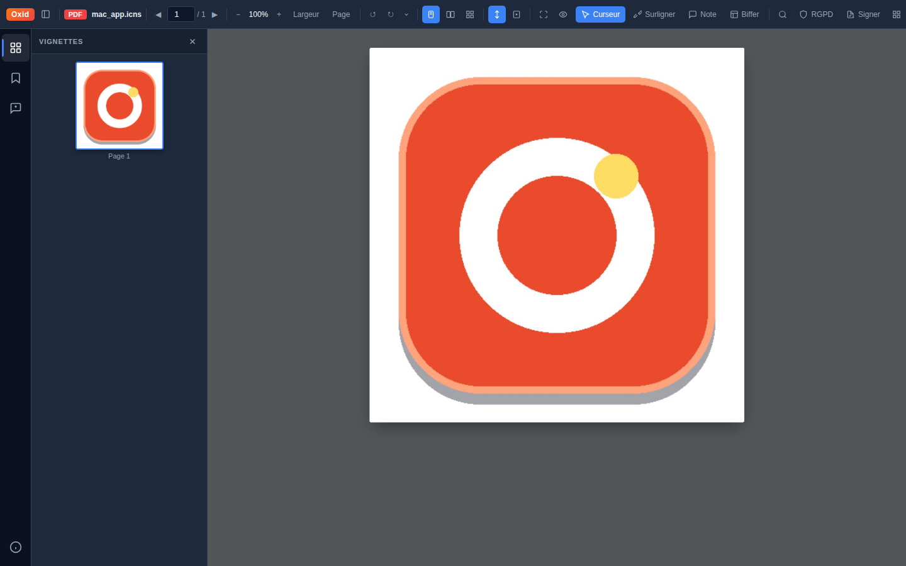

# Oxid 🦀📄

<p align="center">
  
</p>

<p align="center">
  <strong>Moteur de Visualisation & de Conversion Documentaire Universel Haute Performance.</strong><br>
  Serveur asynchrone ultra-léger en <strong>Rust</strong> (Axum, Tokio) & Composant Web autonome en <strong>TypeScript</strong>.
</p>

<p align="center">
  
  
  
  
  
  
</p>

---

## 📸 Modes de Lecture & Mises en Page (Layouts)

Oxid propose une flexibilité d'affichage avancée adaptée aux différents contextes de travail (revue technique, lecture confortable, tri et navigation rapide) :

| Mode Simple Page avec Vignettes Virtuelles | Mode Vue Grille / Mosaïque Multipage |
| :---: | :---: |
|  |  |
| *Affichage linéaire avec barre latérale des vignettes virtualisée (120 FPS)* | *Vue d'ensemble multipage (Planche contact) pour navigation et tri instantané* |

| Mode Double Page / Livre (Spread Reading) | Visualisation Technique CAO / DAO (Calques) |
| :---: | :---: |
|  |  |
| *Affichage côte à côte optimisé pour rapports, revues et brochures* | *Support vectoriel complet AutoCAD avec isolation et filtrage des calques* |

| Photographie Haute Définition Apple (.HEIC) | Icônes & Formats Système macOS (.ICNS) |
| :---: | :---: |
|  |  |
| *Rendu instantané des photos Apple HEIF/HEIC avec fidelité des couleurs* | *Décodeur natif ICNS multi-résolution jusqu'à 1024x1024 sans perte* |

---

## 📂 Formats et Extensions Pris en Charge

Oxid intègre un pipeline de conversion et de rendu capable de traiter nativement plus de **35 formats documentaires et multimédias** :

```
📁 Formats Sources Supportés
 ├── 📄 Documents PDF & Vectoriels     : .pdf, .svg
 ├── 📝 Bureautique & Documents Office : .docx, .doc, .xlsx, .xls, .pptx, .ppt, .odt, .ods, .odp, .rtf
 ├── 📐 Schémas & Diagrammes           : .vsd, .vsdx (Visio), .odg (OpenDocument Draw)
 ├── 🏗️ Ingénierie & Plans CAO/DAO     : .dxf, .dwg (AutoCAD avec gestion des calques vectoriels)
 ├── 🏥 Santé & Imagerie Médicale PACS : .dcm, .dicom (CT, IRM, Radio avec fenêtrage Hounsfield)
 ├── 🍏 Écosystème Apple & macOS       : .heic, .heif (iPhone/Live Photos), .icns (Icônes macOS), .dng (ProRAW)
 ├── ✉️ Messages & Courriels           : .eml, .msg (RFC 822 / Outlook avec extraction pièces jointes)
 ├── ✍️ Texte & Balisage               : .txt, .md, .markdown, .csv, .tsv, .log, .json, .xml, .yaml, .yml
 ├── 🖼️ Images Haute Définition        : .png, .jpg, .jpeg, .webp, .tiff, .tif, .bmp, .gif
 └── 🎬 Multimédia & Vidéo             : .mp4, .webm, .ogv, .mov, .avi, .mkv, .mp3, .wav, .flac
```

| Famille | Extensions | Fonctionnalités Clés |
| :--- | :--- | :--- |
| **PDF & Images** | `pdf`, `png`, `jpg`, `jpeg`, `webp`, `tiff`, `svg` | Rendu tuilé, text layer vectoriel pour sélection/recherche, zoom fluide 500% |
| **Écosystème Apple / Mac** | `heic`, `heif`, `icns`, `dng`, `pict` | Décodage HEIF/HEIC (iPhone), extraction multi-résolutions ICNS (1024px Retina), conversion PDF |
| **Bureautique Office** | `docx`, `xlsx`, `pptx`, `odt`, `ods`, `odp`, `rtf` | Moteur hybride ultra-rapide (Rust natif / Typst / Gotenberg), préservation typographique |
| **Schémas & Visio** | `vsd`, `vsdx`, `odg` | Extraction vectorielle des formes, connecteurs et organigrammes |
| **Ingénierie CAO/DAO** | `dxf`, `dwg` | Détection automatique des calques, activation/masquage au vol, cotations |
| **Imagerie Médicale** | `dcm`, `dicom` | Rendu 16-bit, fenêtrage interactif Hounsfield (Poumon, Os, Cerveau), lecture Ciné-Loop |
| **Courriels & Emails** | `eml`, `msg` | Restitution fidèle des en-têtes (De, À, Date, Sujet) et panneau des pièces jointes |
| **Code & Markdown** | `md`, `txt`, `csv`, `json`, `xml`, `yaml` | Coloration syntaxique, rendu direct des diagrammes Mermaid vectoriels |
| **Vidéo & Audio** | `mp4`, `webm`, `ogv`, `mov`, `avi`, `mp3` | Streaming HTTP Range RFC 7233 (HTTP 206), extraction de poster à 1s, Picture-in-Picture |

---

## ⚡ Performances & Métriques Clés

Mesures certifiées sur un serveur Linux standard (24 cœurs physiques / 64 Go RAM) :

- 🏎️ **Débit de la Passerelle API** : **333 291 requêtes / seconde** (latence médiane 1.12 ms).
- 🖼️ **Débit de Rendu d'Images (Cache L1/L2)** : **96 541 pages / seconde** (5,46 Go/s de bande passante).
- ⚙️ **Rendu Vectoriel Pur (Zéro Cache, 100% CPU)** : **181,0 pages physiques / seconde**.
- 🍃 **Empreinte Mémoire RAM** : **42,5 Mo au repos**, moins de 200 Mo sous une charge de 7 millions de requêtes.
- ⏱️ **Démarrage à Froid** : **< 35 millisecondes**.
- 📦 **Taille du Binaire / Conteneur** : **~55 Mo** (Image Docker unique autonome, sans dépendances lourdes).

---

## 🚀 Moteur de Conversion Headless (Source ➔ PDF)

Oxid intègre une API de conversion directe, ultra-rapide et sécurisée, utilisable directement en backend sans passer par l'interface web :

```bash
# Conversion directe One-Shot avec clé API
curl -X POST http://localhost:8080/api/convert \
  -H "X-API-Key: votre_cle_api" \
  -F "file=@cahier_des_charges.docx" \
  --output cahier_des_charges.pdf
```

Apposez un filigrane dynamique de sécurité :
```bash
curl -X POST "http://localhost:8080/api/convert?watermark=CONFIDENTIEL%20PRO" \
  -H "Authorization: Bearer votre_cle_api" \
  -F "file=@plan_technique.dxf" \
  --output plan_protege.pdf
```

- **Gestion des Quotas Distribués** : Suivi des consommations horaires via Redis (ou mémoire locale).
- **En-têtes HTTP Standards** : `X-RateLimit-Limit`, `X-RateLimit-Remaining`, `X-RateLimit-Reset`.
- **Mode Éphémère (Zero-Retention)** : Suppression physique immédiate des fichiers temporaires après streaming (Conformité RGPD / Secret Professionnel).

Consultez la [Spécification Complète de l'API de Conversion](docs/CONVERSION_API.md).

---

## 🧩 Intégration Web Component (`<oxid-viewer>`)

Le composant autonome `<oxid-viewer>` ne pèse que **17 Ko (gzip)** et s'intègre en 2 lignes dans n'importe quelle application (React, Angular, Vue, Svelte, Vanilla) :

```html
<!-- 1. Importer le bundle ESM -->
<script type="module" src="http://localhost:8080/oxid-viewer.es.js"></script>

<!-- 2. Déclarer le composant -->
<oxid-viewer id="myViewer" doc-id="06f397394498c2cc-582477ec" style="width: 100%; height: 800px;"></oxid-viewer>

<!-- 3. Contrôler via l'API JavaScript -->
<script>
  const viewer = document.getElementById('myViewer');

  // Navigation & Zoom
  viewer.goToPage(1);
  viewer.setZoom(1.25);
  viewer.setViewMode('grid'); // 'single' | 'double' | 'grid'

  // Recherche plein texte et occultation RGPD
  viewer.search("facture");
  viewer.runPiiScan();

  // Export
  viewer.download();
</script>
```

Une page de démonstration interactive complète est disponible sur :  
👉 `http://localhost:8080/demo-component.html`

---

## 📚 Documentation Technique & Architecture

Retrouvez les guides détaillés dans le dossier [`docs/`](docs/) :

- 🏛️ **[Dossier d'Architecture Technique (DAT)](docs/architecture/DOSSIER_ARCHITECTURE.md)** : Modèles C4 complets, pipelines et architecture de cache L1/L2.
- 💾 **[Modèle de Données (MCD / MLD)](docs/architecture/MODELE_DONNEES.md)** : Entités, relations, XFDF et structures Redis.
- 🔄 **[Diagrammes de Flux & Séquences](docs/architecture/DIAGRAMMES_FLUX_ET_SEQUENCES.md)** : Ingestion, streaming vidéo, calques CAO et biffure physique.
- 🛡️ **[Architecture de Sécurité & Conformité](docs/architecture/ARCHITECTURE_SECURITE_ET_CONFORMITE.md)** : Zero-Trust, biffure définitive, masquage PII et RGPD.
- ☸️ **[Modèle de Déploiement & Scalabilité](docs/architecture/MODELE_DEPLOIEMENT_ET_SCALABILITE.md)** : Déploiement Kubernetes multi-zones et autoscaling HPA.
- ⚡ **[Rapport Officiel de Benchmark](docs/BENCHMARK_PERFORMANCES.md)** : Mesures et charges certifiées.
- 🚀 **[API de Conversion Autonome](docs/CONVERSION_API.md)** : Guide d'intégration, quotas et SDK cURL/Node/Python.
- 📘 **[Documentation Technique](docs/DOCUMENTATION_TECHNIQUE.md)** : Spécification complète des API REST.
- 📕 **[Documentation Fonctionnelle](docs/DOCUMENTATION_FONCTIONNELLE.md)** : Guide exhaustif des fonctionnalités métier.
- 💻 **[Guide Développeur Web Component](docs/DEVELOPER_GUIDE.md)** : Guide d'intégration et événements DOM.

---

## 🛠️ Démarrage Rapide

### Avec Docker Compose
```bash
docker compose up -d
```
L'application est disponible immédiatement sur `http://localhost:8080`.

### En Local (Développement)
```bash
# 1. Compiler le frontend
cd frontend && npm install && npm run build

# 2. Démarrer le serveur Rust
cd ../backend && cargo run --release
```

---

## 📄 Licence

Oxid est un logiciel libre et open source distribué sous licence **MIT** (très permissive pour un usage commercial et privé). Consultez le fichier [LICENSE](LICENSE) pour plus de précisions.
