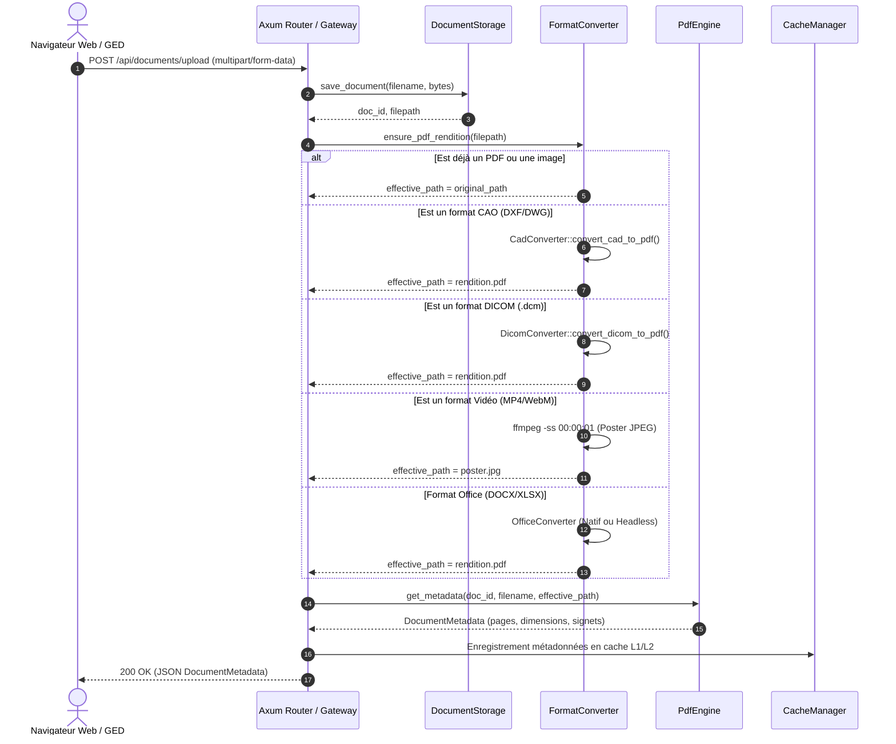
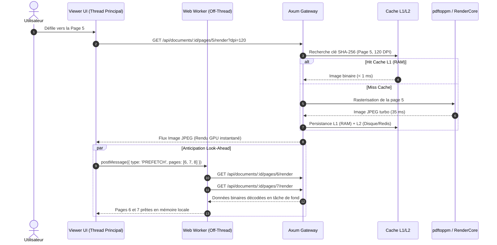
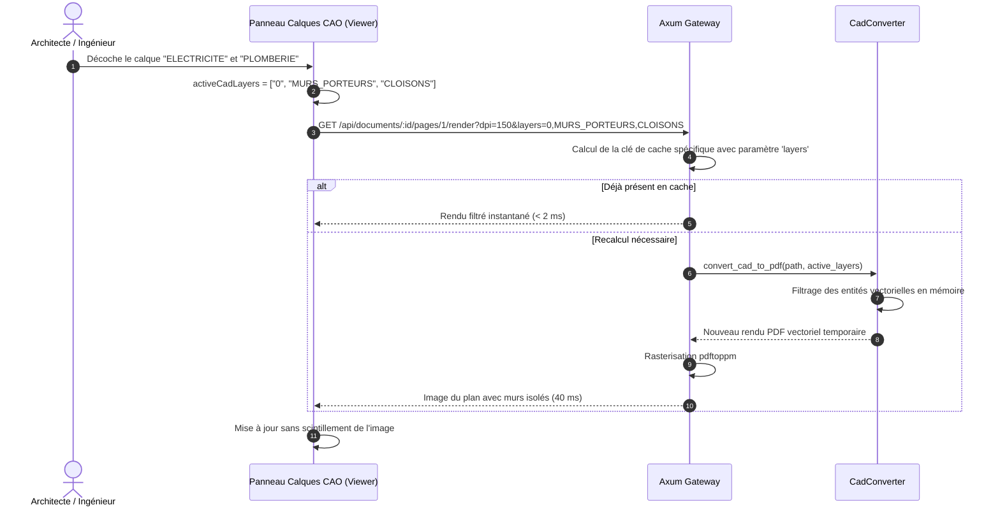
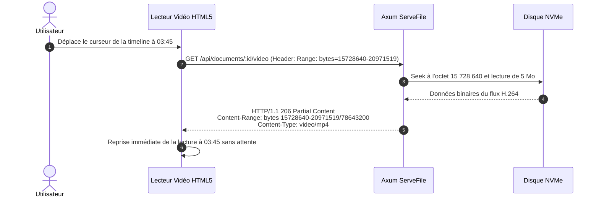
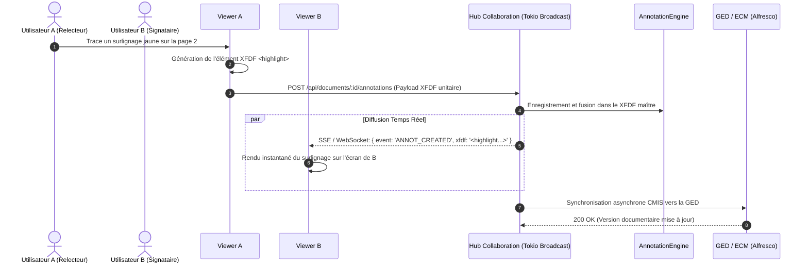
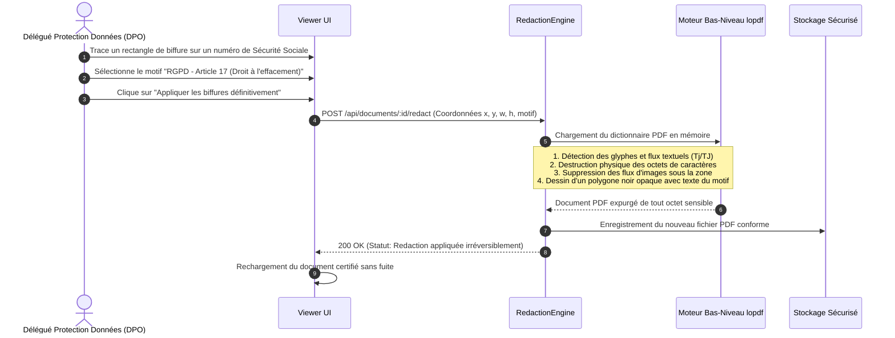

# 🔄 Modèles de Flux & Diagrammes de Séquence — Oxid

Ce document détaille les cinématiques d'échanges, les protocoles et les diagrammes de séquence des processus clés de la plateforme **Oxid**.

---

## 1. Flux d'Ingestion & Conversion Documentaire

Ce flux décrit le cycle de vie complet depuis la réception d'un document brut jusqu'à sa mise à disposition pour affichage.

---

## 2. Flux de Rendu avec Cache Hiérarchique & Look-Ahead Worker

Ce flux illustre la récupération d'une page par le viewer et l'anticipation prédictive des pages suivantes par le Web Worker.

---

## 3. Flux de Filtrage Dynamique des Calques CAO / DAO

Ce flux illustre le recalcul vectoriel à la volée lorsqu'un architecte ou ingénieur masque/affiche des calques métiers.

---

## 4. Flux de Streaming Vidéo HTTP Range (RFC 7233)

Ce flux décrit le mécanisme de saut temporel (*seeking / scrubbing*) instantané dans un fichier vidéo sans téléchargement complet.

---

## 5. Flux de Collaboration Temps Réel sur Annotations XFDF

Ce flux illustre la synchronisation bidirectionnelle multi-utilisateurs conforme à la norme ISO 19444-1.

---

## 6. Flux de Biffure Permanente (Burn-in Redaction RGPD)

Ce flux détaille la destruction physique irréversible des données sensibles sous-jacentes.

