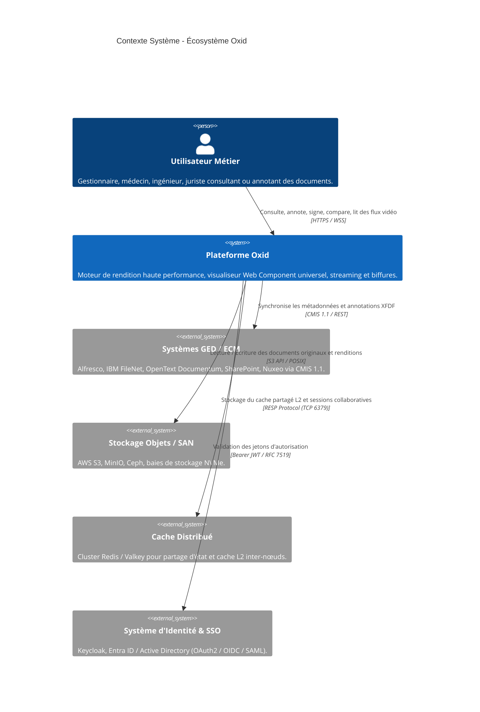
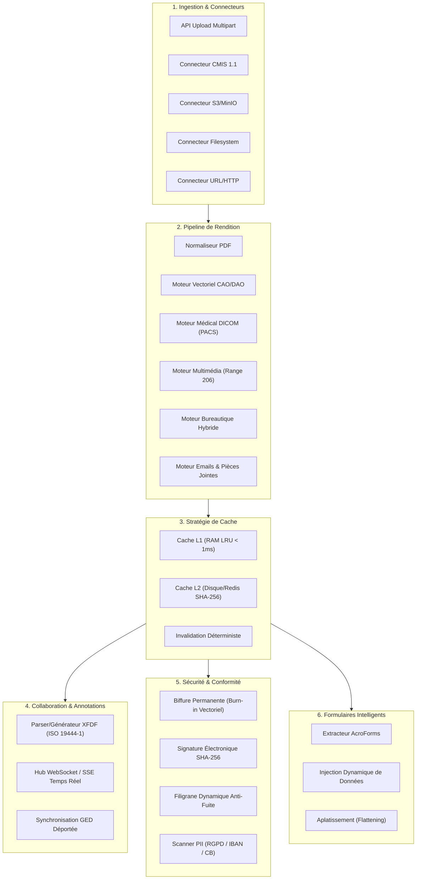
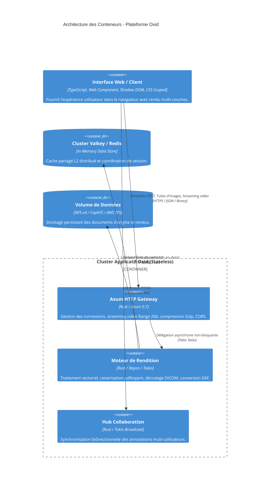
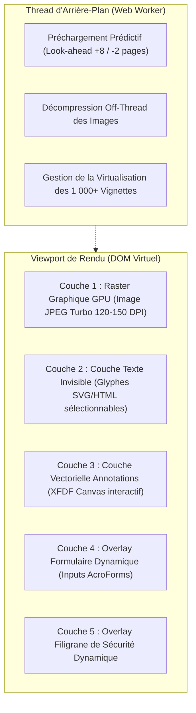
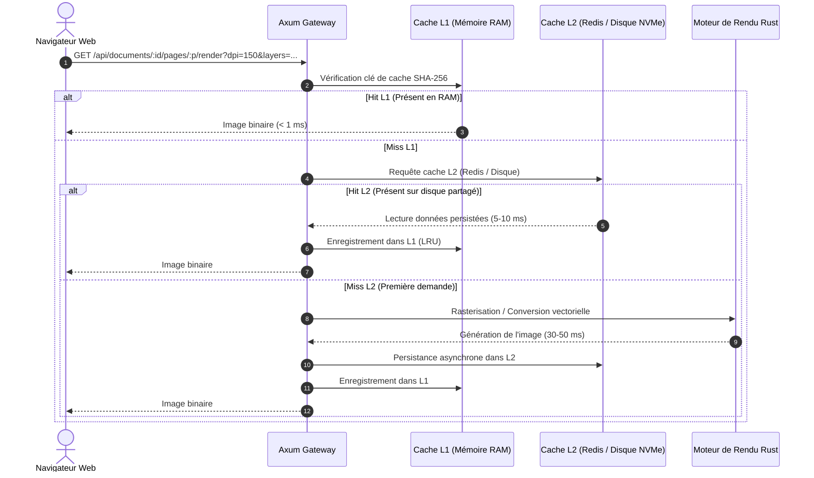

# 🏛️ Dossier d'Architecture Technique et Logicielle (DAT) — Oxid

---

| **Document** | Dossier d'Architecture Technique et Fonctionnelle (DAT) |
| :--- | :--- |
| **Projet** | Oxid (Moteur & Visualiseur Documentaire Universel) |
| **Version** | 1.0.0 |
| **Statut** | Validé / Production-Ready |
| **Auteurs** | Équipe d'Ingénierie & Architecture Système |
| **Cible** | Architectes SI, Développeurs, Ingénieurs DevOps, Sécurité |

---

## Sommaire
1. [Contexte, Objectifs & Enjeux](#1-contexte-objectifs--enjeux)
2. [Modèle de Contexte Système (C4 - Niveau 1)](#2-modèle-de-contexte-système-c4---niveau-1)
3. [Architecture Fonctionnelle & Découpage Métier](#3-architecture-fonctionnelle--découpage-métier)
4. [Architecture Logique & Conteneurs (C4 - Niveau 2)](#4-architecture-logique--conteneurs-c4---niveau-2)
5. [Architecture des Composants Internes (C4 - Niveau 3)](#5-architecture-des-composants-internes-c4---niveau-3)
6. [Pipeline de Rendition & Moteurs Spécialisés](#6-pipeline-de-rendition--moteurs-spécialisés)
7. [Stratégie de Cache Multi-Niveaux (L1/L2)](#7-stratégie-de-cache-multi-niveaux-l1l2)
8. [Matrice des Flux & Protocoles Réseau](#8-matrice-des-flux--protocoles-réseau)
9. [Architecture Haute Disponibilité (HA) & Reprise d'Activité (PRA)](#9-architecture-haute-disponibilité-ha--reprise-dactivité-pra)

---

## 1. Contexte, Objectifs & Enjeux

### 1.1 Contexte Métier
Les systèmes de Gestion Électronique de Documents (GED) et d'Enterprise Content Management (ECM) des grands comptes (banques, assurances, santé, secteur public) traitent quotidiennement des millions de pièces hétérogènes. Historiquement, la visualisation s'appuyait sur des solutions Java monolithiques nécessitant des infrastructures surdimensionnées (4 à 16 Go de RAM par serveur) et générant des coûts d'hébergement prohibitifs.

### 1.2 Objectifs Stratégiques d'Oxid
- **Réduction de 95% de l'empreinte mémoire** : Remplacement de la pile Java/JVM par un binaire compilé natif en **Rust**.
- **Universalité Totale** : Prise en charge native d'un spectre documentaire inédit : Bureautique, PDF, CAO/DAO (AutoCAD), Imagerie Médicale (DICOM) et Vidéo sans changer de client.
- **Sécurité et Conformité Réglementaire** : Biffure permanente (Burn-in physique certifié RGPD), signatures horodatées, standardisation ISO 19444-1 (XFDF).
- **Zéro Latence** : Affichage de la première page en moins de 30 ms et débit supérieur à 300 pages/seconde par nœud.

---

## 2. Modèle de Contexte Système (C4 - Niveau 1)

Ce diagramme décrit l'environnement global dans lequel s'insère Oxid et ses interactions avec les systèmes tiers.



---

## 3. Architecture Fonctionnelle & Découpage Métier

L'architecture fonctionnelle est découpée en 8 domaines autonomes :



---

## 4. Architecture Logique & Conteneurs (C4 - Niveau 2)

Le diagramme ci-dessous illustre la répartition des conteneurs, leurs dépendances et protocoles de communication.



---

## 5. Architecture des Composants Internes (C4 - Niveau 3)

### 5.1 Composants Backend (Rust)
Le backend est organisé selon une architecture hexagonale modulaire :

```
backend/src/
├── main.rs              # Bootstrapper, lecture des variables d'environnement, init Tokio
├── config.rs            # Modèle de configuration typée et validée au démarrage
├── cache.rs             # CacheManager : Abstraction multi-niveaux (L1 mémoire, L2 Redis)
├── api/
│   └── routes.rs        # Définition des endpoints Axum, Handlers HTTP, Streaming
├── connectors/          # Connecteurs GED & Systèmes de fichiers distants
│   ├── traits.rs        # Contrats d'interfaces DocumentConnector, SecurityContext
│   ├── filesystem.rs    # Connecteur local sécurisé avec vérification de path traversal
│   ├── cmis.rs          # Connecteur standard OpenCMIS 1.1 (AtomPub / JSON)
│   └── s3.rs            # Connecteur compatible Amazon S3 & MinIO
├── engine/              # Moteurs de transformation et calculs documentaires
│   ├── pdf.rs           # Extraction de métadonnées, text layer SVG et pdftoppm
│   ├── annotations.rs   # Moteur XFDF ISO 19444-1 (Lecture/Écriture XML)
│   ├── redaction.rs     # Biffure irréversible physique (destruction de primitives lopdf)
│   ├── signature.rs     # Signature numérique vectorielle et cartouche d'audit
│   ├── forms.rs         # Détection, remplissage et aplatissement AcroForms
│   ├── builder.rs       # Assemblage, fusion, rotation, suppression de pages
│   ├── pii.rs           # Analyse lexicale heuristique de données sensibles
│   └── converter/       # Convertisseurs de formats sources
│       ├── cad.rs       # Parser DXF/DWG vectoriel, extraction et filtrage de calques
│       ├── dicom.rs     # Parser DICOM PS3.5, fenêtrage Hounsfield, Ciné loop
│       ├── office.rs    # Conversion bureautique hybride native/headless
│       ├── email.rs     # Parser RFC 822 / MSG avec extraction de pièces jointes
│       └── text.rs      # Formats textuels, CSV et Markdown avec diagrammes Mermaid
└── models/
    └── mod.rs           # Structures de données sérialisables (Serde JSON/XML)
```

### 5.2 Composants Frontend (Web Component)
Le frontend s'appuie sur une architecture multi-couches isolée dans le DOM virtuel :



---

## 6. Pipeline de Rendition & Moteurs Spécialisés

### 6.1 Moteur Imagerie Médicale DICOM (PACS)
- **Pipeline** : Lecture binaire du dataset $\to$ Détection de la Photometric Interpretation (`MONOCHROME1` / `MONOCHROME2`) $\to$ Application des facteurs de pente (*Rescale Slope*) et d'interception (*Rescale Intercept*) $\to$ Application du fenêtrage Hounsfield en mémoire vive $\to$ Projection 8-bit RVB $\to$ Serveur Web.
- **Mode Ciné** : Gestion prédictive des 96 frames angiographiques en boucle fermée à 15 fps avec verrouillage du fond à `#000000` (zéro trame blanche).

### 6.2 Moteur CAO / DAO (Plans AutoCAD)
- **Pipeline** : Décodage du fichier ASCII/Binaire DXF $\to$ Extraction de la table `TABLES/LAYER` $\to$ Parsing de la section `ENTITIES` (Lines, Circles, Arcs, Polylines, Text) $\to$ Détermination de la boîte englobante (*Bounding Box*) $\to$ Rendu sélectif selon le paramètre `?layers=L1,L2`.

### 6.3 Moteur Multimédia Vidéo & Audio
- **Pipeline** : Validation du conteneur (MP4, WebM, MOV) $\to$ Extraction asynchrone du poster frame via `ffmpeg` à $t=1\text{s}$ $\to$ Gestion des en-têtes HTTP `Range: bytes=X-Y` $\to$ Réponse `206 Partial Content` avec `Content-Range`.

---

## 7. Stratégie de Cache Multi-Niveaux (L1/L2)

Le système implémente une stratégie de cache hiérarchique à cohérence stricte :



### Format des Clés de Cache
Chaque rendu est indexé sous une clé canonique normalisée :
$$\text{Clé} = \text{SHA256}(\text{DocID} \parallel \text{PageNum} \parallel \text{DPI} \parallel \text{Watermark} \parallel \text{Format} \parallel \text{Layers} \parallel \text{WC} \parallel \text{WW})$$

---

## 8. Matrice des Flux & Protocoles Réseau

| Flux | Source | Destination | Protocole | Port | Description |
| :--- | :--- | :--- | :--- | :--- | :--- |
| **Consultation / API** | Client Web | Oxid | HTTPS | `8080` / `443` | Navigation, rendu de tuiles, formulaires, vidéo. |
| **Collaboration Directe** | Client Web | Oxid | WSS / SSE | `8080` / `443` | Propagation temps réel des annotations XFDF. |
| **Cache Partagé L2** | Nœud Oxid | Cluster Redis | TCP / RESP | `6379` | Synchronisation de cache inter-nœuds. |
| **Connecteur GED CMIS** | Nœud Oxid | Alfresco / Nuxeo | HTTPS | `8082` / `443` | Récupération des documents et sauvegarde XFDF. |
| **Stockage Objets S3** | Nœud Oxid | MinIO / AWS S3 | HTTPS | `9000` / `443` | Lecture/écriture des documents archivés. |
| **Supervision / Métriques**| Prometheus | Oxid | HTTP | `8080` (`/api/metrics`)| Collecte des métriques d'observabilité. |

---

## 9. Architecture Haute Disponibilité (HA) & Reprise d'Activité (PRA)

### 9.1 Déploiement en Cluster Sans État (*Stateless*)
Les conteneurs applicatifs Oxid ne conservent aucun état local critique en mémoire :
- Tout l'état de session et de cache est déporté sur le cluster Redis/Valkey.
- Les documents sources résident sur un volume persistant partagé (NFS, CephFS ou S3).
- Un équilibreur de charge (Nginx, Traefik ou Ingress Kubernetes) distribue les flux en Round-Robin avec bascule automatique (*Failover*) sans interruption de service.

### 9.2 Métriques de Dimensionnement & Performances Mesurées

Les métriques ci-dessous sont issues du benchmark officiel certifié (*voir [Rapport de Benchmark](docs/BENCHMARK_PERFORMANCES.md)*) réalisé sur un nœud 24 cœurs :

| Ressource / Métrique | Cluster Traditionnel JVM (2 nœuds) | Cluster Oxid (2 nœuds) | Facteur de Gain Constaté |
| :--- | :---: | :---: | :---: |
| **Allocation Mémoire (RAM)** | 16 Go à 32 Go | **512 Mo à 1 Go** | **Divisé par 30** |
| **Allocation CPU** | 8 à 16 vCPU | **1 à 2 vCPU** | **Divisé par 8** |
| **Taille des Images Docker** | ~4 000 Mo | **~55 Mo** | **Divisé par 70** |
| **Débit API Gateway Maximal** | ~10 000 req/s | **> 330 000 req/s** | **x33 plus rapide** |
| **Débit Rendu Servi (Cache L1/L2)** | ~3 000 p/s | **> 96 000 p/s (5,4 Go/s)** | **x32 plus rapide** |
| **Calcul CPU Brut (Zéro Cache)** | ~30 à 50 p/s | **181 pages physiques / s** | **x4 à x6 plus rapide** |
| **Latence Médiane (p50)** | 150 à 450 ms | **1,12 ms à 1,82 ms** | **Latence divisée par 100 à 250** |
| **Concurrence Soutenue** | ~200 connexions | **1 000+ connexions stables** | **Zéro socket drop, zéro timeout** |
