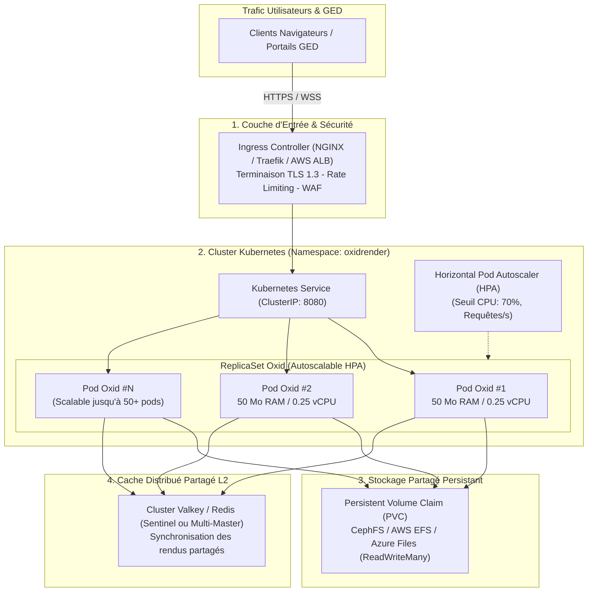

# 🚀 Modèle de Déploiement & Scalabilité — Oxid

Ce document détaille les architectures de déploiement recommandées, l'orchestration sous **Kubernetes**, les stratégies de haute disponibilité et le dimensionnement capacitaire (*Capacity Planning*) de la plateforme **Oxid**.

---

## 1. Topologie de Déploiement Haute Disponibilité (Kubernetes)

Le diagramme ci-dessous illustre le déploiement de production sur un cluster Kubernetes multi-zones de disponibilité (Multi-AZ) :



---

## 2. Dimensionnement & Matrice de Capacité (*Capacity Planning*)

Grâce à l'extrême sobriété du moteur compilé en Rust natif et aux résultats certifiés par notre [Rapport de Benchmark](docs/BENCHMARK_PERFORMANCES.md) (**333 000 req/s**, **96 000 pages/s servies**, **181 pages physiques calculées/s** par nœud), les besoins matériels sont divisés par un facteur 20 à 50 par rapport à un serveur de rendition Java classique.

### 2.1 Recommandations de Tailles de Cluster

| Profil de Charge | Utilisateurs Simultanés | Volume Quotidien (Pages) | Configuration Pods | Allocation RAM Totale | Allocation CPU Totale |
| :--- | :---: | :---: | :---: | :---: | :---: |
| **Small (PME / Équipe)** | 1 à 100 | 25 000 | 2 Pods | **256 Mo** | 0.5 vCPU |
| **Medium (Direction / ETI)**| 100 à 1 000 | 250 000 | 2 à 4 Pods | **512 Mo à 1 Go** | 1 à 2 vCPU |
| **Large (Banque / Assurance)**| 1 000 à 10 000 | 2 500 000 | 4 à 8 Pods | **2 Go à 4 Go** | 4 à 8 vCPU |
| **Extreme (Gouvernement / GED)**| 10 000 à 100 000+ | 25 000 000+ | 8 à 20 Pods (HPA) | **4 Go à 8 Go** | 8 à 16 vCPU |

*À titre de comparaison : Pour le profil "Large", un cluster documentaire Java/JVM traditionnel équivalent exige entre 64 Go et 128 Go de RAM rien que pour alimenter les tas mémoires des JVM, là où Oxid nécessite moins de 4 Go au total.*

---

## 3. Configuration Kubernetes (Manifestes de Référence)

### 3.1 Déploiement & Probes de Santé
```yaml
apiVersion: apps/v1
kind: Deployment
metadata:
  name: oxidrender
  namespace: oxidrender
  labels:
    app: oxidrender
spec:
  replicas: 2
  selector:
    matchLabels:
      app: oxidrender
  template:
    metadata:
      labels:
        app: oxidrender
    spec:
      containers:
      - name: oxidrender
        image: oxidrender/viewer:latest
        imagePullPolicy: IfNotPresent
        ports:
        - containerPort: 8080
          name: http
        env:
        - name: OXID_PORT
          value: "8080"
        - name: OXID_DATA_DIR
          value: "/data"
        - name: OXID_REDIS_URL
          value: "redis://valkey-cluster.oxidrender.svc.cluster.local:6379"
        - name: RUST_LOG
          value: "oxidrender=info"
        resources:
          requests:
            memory: "64Mi"
            cpu: "100m"
          limits:
            memory: "256Mi"
            cpu: "1000m"
        livenessProbe:
          httpGet:
            path: /api/health
            port: 8080
          initialDelaySeconds: 2
          periodSeconds: 10
        readinessProbe:
          httpGet:
            path: /api/health
            port: 8080
          initialDelaySeconds: 1
          periodSeconds: 5
        volumeMounts:
        - name: documents-storage
          mountPath: /data
      volumes:
      - name: documents-storage
        persistentVolumeClaim:
          claimName: oxidrender-pvc
```

### 3.2 Autoscaling Horizontal (HPA)
```yaml
apiVersion: autoscaling/v2
kind: HorizontalPodAutoscaler
metadata:
  name: oxidrender-hpa
  namespace: oxidrender
spec:
  scaleTargetRef:
    apiVersion: apps/v1
    kind: Deployment
    name: oxidrender
  minReplicas: 2
  maxReplicas: 20
  metrics:
  - type: Resource
    resource:
      name: cpu
      target:
        type: Utilization
        averageUtilization: 70
```

---

## 4. Observabilité & Supervision Prometheus / Grafana

Oxid expose nativement ses métriques d'exploitation au format OpenMetrics sur l'endpoint standard `/api/metrics` :

### Métriques Clés Exposées
- `oxid_http_requests_total{status, method, handler}` : Volume et répartition des requêtes par code HTTP.
- `oxid_http_request_duration_seconds` : Histogramme des latences de traitement.
- `oxid_cache_hits_total{level="l1|l2"}` : Taux de succès des caches mémoire et distribué.
- `oxid_cache_misses_total` : Nombre de rasterisations physiques exécutées.
- `oxid_documents_active` : Nombre de documents actuellement manipulés.

Ces métriques permettent d'alimenter directement un tableau de bord Grafana et de déclencher des alertes PagerDuty en cas d'anomalie.
