# 📊 Modèle de Données Conceptuel et Logique (MCD / MLD) — Oxid

Ce document détaille l'ensemble des structures de données, des modèles entités-relations et des schémas d'échanges utilisés par la plateforme **Oxid**.

---

## 1. Modèle Entité-Relation (ER Diagram)

Ce schéma représente les relations conceptuelles entre les entités du système.

```mermaid
erDiagram
    DOCUMENT ||--|{ PAGE : "contient"
    DOCUMENT ||--o{ ATTACHMENT : "embarque"
    DOCUMENT ||--o{ BOOKMARK : "structure"
    DOCUMENT ||--o{ ANNOTATION : "recoit"
    DOCUMENT ||--o{ REDACTION : "applique"
    DOCUMENT ||--o{ FORM_FIELD : "definit"
    DOCUMENT ||--o| CAD_METADATA : "possede (si CAO)"
    DOCUMENT ||--o| DICOM_METADATA : "possede (si medical)"
    DOCUMENT ||--o{ DIGITAL_SIGNATURE : "valide"
    
    CAD_METADATA ||--|{ CAD_LAYER : "se compose de"
    DICOM_METADATA ||--|{ DICOM_PRESET : "offre"

    DOCUMENT {
        string id PK "Identifiant unique UUID / Hash"
        string filename "Nom original du fichier"
        string mime_type "Type MIME detecte"
        int file_size "Taille brute en octets"
        int page_count "Nombre total de pages"
        timestamp created_at "Horodatage de creation"
    }

    PAGE {
        int page_number PK "Numero d'ordre (1-indexe)"
        float width "Largeur normalisee en points"
        float height "Hauteur normalisee en points"
        int rotation "Angle d'orientation (0, 90, 180, 270)"
    }

    ANNOTATION {
        string id PK "UUID de l'annotation"
        string annotation_type "Type XFDF (highlight, freetext, stamp, ...)"
        int page_number "Page cible"
        string author "Auteur ou utilisateur GED"
        string content "Commentaire ou texte associe"
        json coordinates "Coordonnees x, y, width, height ou points"
        string color_hex "Couleur de rendu (#RRGGBB)"
        timestamp modified_at "Horodatage derniere modification"
    }

    REDACTION {
        string id PK "UUID de la demande"
        int page_number "Page cible"
        float x "Coordonnee X inferieure gauche"
        float y "Coordonnee Y inferieure gauche"
        float width "Largeur de la zone biffee"
        float height "Hauteur de la zone biffee"
        string reason "Motif legal (RGPD, Secret Medical)"
        boolean applied "Statut de burn-in physique"
    }

    CAD_METADATA {
        float width "Largeur de la boite englobante"
        float height "Hauteur de la boite englobante"
        string units "Unite de dessin (mm, m, inches)"
    }

    CAD_LAYER {
        string name PK "Nom technique du calque (ex: MURS)"
        string color_hex "Couleur ACI traduite en RGB Hex"
        boolean is_visible "Etat de visibilite par defaut"
        int entity_count "Nombre d'entites vectorielles associees"
    }

    DICOM_METADATA {
        string patient_name "Identite anonymisee du patient"
        string patient_id "Identifiant dossier medical"
        string modality "Modalite d'acquisition (CT, MR, XA)"
        float window_center "Centre de fenetre Hounsfield (WC)"
        float window_width "Largeur de fenetre Hounsfield (WW)"
        float rescale_slope "Pente de recalibrage Hounsfield"
        float rescale_intercept "Interception Hounsfield"
    }

    FORM_FIELD {
        string name PK "Nom canonique du champ AcroForm"
        string field_type "Text, CheckBox, Radio, Choice, Signature"
        int page_number "Page d'implantation"
        string value "Valeur saisie ou selectionnee"
        boolean is_required "Caractere obligatoire"
        boolean is_readonly "Verrouillage en lecture seule"
    }
```



---

## 2. Structures de Données Détaillées (Rust & JSON)

### 2.1 Métadonnées Globales du Document (`DocumentMetadata`)
Modèle pivot retourné lors de l'ouverture ou de l'ingestion d'un document.

```rust
#[derive(Clone, Debug, Serialize, Deserialize)]
pub struct DocumentMetadata {
    pub id: String,
    pub filename: String,
    pub mime_type: String,
    pub file_size: u64,
    pub page_count: usize,
    pub pages: Vec<PageMetadata>,
    pub bookmarks: Vec<BookmarkItem>,
    pub attachments: Vec<EmailAttachment>,
}

#[derive(Clone, Debug, Serialize, Deserialize)]
pub struct PageMetadata {
    pub page_number: usize,
    pub width: f64,
    pub height: f64,
    pub rotation: i32,
}
```

**Exemple de payload JSON :**
```json
{
  "id": "06f397394498c2cc-f6272509",
  "filename": "plan_architectural.dxf",
  "mime_type": "application/pdf",
  "file_size": 1223,
  "page_count": 1,
  "pages": [
    {
      "page_number": 1,
      "width": 842.0,
      "height": 595.0,
      "rotation": 0
    }
  ],
  "bookmarks": [],
  "attachments": []
}
```

---

### 2.2 Modèle CAO / DAO (`CadMetadata` & `CadLayerInfo`)
Permet la manipulation des couches techniques des plans d'architectes et schémas d'ingénierie.

```rust
#[derive(Clone, Debug, Serialize, Deserialize)]
pub struct CadMetadata {
    pub layers: Vec<CadLayerInfo>,
    pub width: f64,
    pub height: f64,
    pub units: String,
}

#[derive(Clone, Debug, Serialize, Deserialize)]
pub struct CadLayerInfo {
    pub name: String,
    pub color_hex: String,
    pub is_visible: bool,
    pub entity_count: usize,
}
```

**Exemple de payload JSON :**
```json
[
  { "name": "0", "color_hex": "#FFFFFF", "is_visible": true, "entity_count": 0 },
  { "name": "MURS_PORTEURS", "color_hex": "#FF0000", "is_visible": true, "entity_count": 4 },
  { "name": "ELECTRICITE", "color_hex": "#FFFF00", "is_visible": true, "entity_count": 4 },
  { "name": "PLOMBERIE", "color_hex": "#00FFFF", "is_visible": true, "entity_count": 3 },
  { "name": "COTATIONS", "color_hex": "#00FF00", "is_visible": true, "entity_count": 5 },
  { "name": "CLOISONS", "color_hex": "#0066FF", "is_visible": true, "entity_count": 2 }
]
```

---

### 2.3 Modèle Imagerie Médicale DICOM (`DicomMetadata`)
Structures dédiées au visualiseur PACS médical et fenêtrage de densité Hounsfield.

```rust
#[derive(Clone, Debug, Serialize, Deserialize)]
pub struct DicomMetadata {
    pub patient_name: Option<String>,
    pub patient_id: Option<String>,
    pub study_date: Option<String>,
    pub modality: Option<String>,
    pub institution: Option<String>,
    pub window_center: Option<f64>,
    pub window_width: Option<f64>,
    pub rescale_intercept: f64,
    pub rescale_slope: f64,
    pub presets: Vec<DicomPreset>,
}

#[derive(Clone, Debug, Serialize, Deserialize)]
pub struct DicomPreset {
    pub name: String,
    pub label: String,
    pub window_center: f64,
    pub window_width: f64,
    pub description: String,
}
```

---

### 2.4 Modèle Annotations XFDF (ISO 19444-1)
Le schéma est normalisé selon le standard international ISO :

```xml
<?xml version="1.0" encoding="UTF-8"?>
<xfdf xmlns="http://ns.adobe.com/xfdf/" xml:space="preserve">
  <annots>
    <highlight page="0" rect="72,700,280,720" color="#FFFF00" opacity="0.5" author="Dr. Dupont" date="D:20260912183000Z">
      <contents>Relecture du paragraphe 3 requise</contents>
    </highlight>
    <freetext page="0" rect="100,500,250,540" color="#FF0000" font="Helvetica" fontsize="12">
      <contents>Mention obligatoire</contents>
    </freetext>
    <stamp page="0" rect="400,100,550,150" title="APPROUVE" color="#10B981" />
  </annots>
</xfdf>
```

---

## 3. Schéma de Persistance & Clés de Cache

### 3.1 Clés de Cache Redis / Valkey (Niveau L2)

| Motif de Clé | Type | TTL | Description |
| :--- | :--- | :--- | :--- |
| `oxid:rend:{doc_id}:{p}:{dpi}:{variant}:{layers}:{wc}:{ww}` | Binary Blob | 7 jours | Image binaire de la page rasterisée. |
| `oxid:meta:{doc_id}` | JSON String | 24 heures | Cache des métadonnées du document. |
| `oxid:xfdf:{doc_id}` | XML String | Sans TTL | Contenu XFDF des annotations en cours. |
| `oxid:collab:{doc_id}:users` | Set | 30 minutes | Liste des identifiants d'utilisateurs connectés en direct. |

### 3.2 Structure de Stockage Disque Local (`OXID_DATA_DIR`)

```
data/
└── documents/
    ├── 06f397394498c2cc-f6272509.dxf              # Document source d'origine
    ├── 06f397394498c2cc-f6272509.dxf.rendition.pdf # Rendition intermédiaire normalisée
    ├── 06f397394498c2cc-f6272509.xfdf             # Fichier d'annotations XFDF persistant
    ├── adc623b0a510b9a3-2be90bc3.mp4              # Fichier vidéo source
    ├── adc623b0a510b9a3-2be90bc3.mp4.poster.jpg   # Miniature JPEG extraite par ffmpeg
    └── cache/                                     # Cache L2 local sur disque NVMe
        └── 06f397394498c2cc-f6272509/
            ├── 1_150_orig_default.jpg
            └── 1_150_orig_default_MURS_PORTEURS.jpg
```
